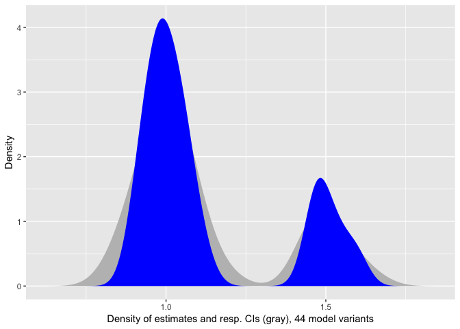

Joachim Gassen

Researcher Degrees of Freedom Analysis
======================================

A package to explore and document your degrees of freedom
---------------------------------------------------------

This experimental in-development package provides a set of functions to develop data anylsis code that systematically documents researcher degrees of freedom when conducting analyses on observational data. The resulting code base is self-documenting, supports unit testing and power simulations based on simulated data. The documented researcher degrees of freedom can be exhausted to generate a distribution of outcome estimates.

### First: Define your research design by a series of functions

``` r
sim_data <- function(input = NULL, choice = NULL) {
  step_description <- doc(
    "## Simulates Data",
    "### Content",
    "",
    "This step simulates some data.",
    "The used equation is $y = x + z + \\epsilon$",
    "with $z$ being N(0,1) distributed and $x$ being potentially endogenous to $z$ (see choices below)"
  )
  choice_description <- doc(
    "### Choice",
    "",
    "A list containing a character value `make_x_endogenous` and a numerical value `noise_y`.", 
    "`make_x_endogenous` may take one of the following values:",
    "",
    "- `yes`: x will depend on z",
    "- `no`: x will not depend on z",
    "",
    "`noise_y` sets the standard deviation of the error term affecting y",
    "and may take any value within [1, 2]"
  )
  choice_type <- list(
    list(name = "make_x_endogenous", 
         type = "character", 
         valid_values = c("yes", "no")),
    list(name = "noise_y", 
         type = "double", 
         valid_min = 1, valid_max = 2)
  )
  if (is.null(choice)) return(list(
    step_description = step_description,
    choice_description = choice_description,
    choice_type = choice_type
  )) else check_choice(choice, choice_type)

  z <- rnorm(1000)
  x <- rnorm(1000) 
  if (choice[[1]] == "yes") x <- x + z
  y <- x + z + rnorm(1000, sd = choice[[2]]) 
  return(list(
    data = data.frame(x = x, y = y, z = z),
    protocol = choice
  ))
}


est_model <- function(input = NULL, choice = NULL) {
  step_description <- doc(
    "## Estimate model",
    "### Content",
    "",
    "This step estimates on OLS model based on the simulated data of the last step"
  )
  choice_description <- doc(
    "### Choice",
    "",
    "A character value `control_for_z` that may take one of the following values:",
    "",
    "- `yes`: control for z",
    "- `no`: do not control for z"
  )
  choice_type <- list(
    list(name = "control_for_z", 
         type = "character", 
         valid_values = c("yes", "no"))
  )
  if (is.null(choice)) return(list(
    step_description = step_description,
    choice_description = choice_description,
    choice_type = choice_type
  )) else check_choice(choice, choice_type)

  if(choice[[1]] == "yes") 
    mod <- lm(y ~ x + z, data = input$data)
  else     mod <- lm(y ~ x, data = input$data)
  return(list(
    data = list(
      est = summary(mod)$coefficient[2,1],
      lb = confint(mod)[2,1],
      ub = confint(mod)[2,2]
    ),
    protocol = c(input$protocol, choice)
  ))  
} 

design <- c("sim_data", "est_model")
```

Second: Display your design and verify it by testing it
-------------------------------------------------------

``` r
prepare_design_flow_chart(design, landscape = TRUE)
```


``` r
test_design(design, reporter = "minimal")
```

    ## ......................................................

Third: Run a single protocol
============================

``` r
sim_data(NULL, list("no", 2)) %>%
  est_model("no")
```

    ## $data
    ## $data$est
    ## [1] 0.8756298
    ## 
    ## $data$lb
    ## [1] 0.7366817
    ## 
    ## $data$ub
    ## [1] 1.014578
    ## 
    ## 
    ## $protocol
    ## $protocol[[1]]
    ## [1] "no"
    ## 
    ## $protocol[[2]]
    ## [1] 2
    ## 
    ## $protocol[[3]]
    ## [1] "no"

Fourth: Exhaust your research degrees of freedom
================================================

``` r
df <- exhaust_design(design, NULL) 
```

``` r
plot_rdf_estimates(df, est = "est", lb = "lb", ub = "ub")
```



``` r
kable(df)
```

| make\_x\_endogenous |  noise\_y| control\_for\_z |        est|         lb|        ub|
|:--------------------|---------:|:----------------|----------:|----------:|---------:|
| yes                 |       1.0| yes             |  1.0147593|  0.9514575|  1.078061|
| no                  |       1.0| yes             |  1.0571585|  0.9996789|  1.114638|
| yes                 |       1.1| yes             |  1.0240420|  0.9540567|  1.094027|
| no                  |       1.1| yes             |  0.9660193|  0.8940830|  1.037956|
| yes                 |       1.2| yes             |  0.9940312|  0.9191713|  1.068891|
| no                  |       1.2| yes             |  0.9896571|  0.9185544|  1.060760|
| yes                 |       1.3| yes             |  0.9815524|  0.8991856|  1.063919|
| no                  |       1.3| yes             |  0.9976779|  0.9168523|  1.078504|
| yes                 |       1.4| yes             |  1.0436102|  0.9593830|  1.127838|
| no                  |       1.4| yes             |  1.0359416|  0.9456444|  1.126239|
| yes                 |       1.5| yes             |  1.0053913|  0.9130450|  1.097738|
| no                  |       1.5| yes             |  0.9544659|  0.8577986|  1.051133|
| yes                 |       1.6| yes             |  1.0683020|  0.9717061|  1.164898|
| no                  |       1.6| yes             |  1.0688080|  0.9651853|  1.172431|
| yes                 |       1.7| yes             |  0.9812754|  0.8751635|  1.087387|
| no                  |       1.7| yes             |  1.0698950|  0.9642885|  1.175501|
| yes                 |       1.8| yes             |  1.0829369|  0.9565216|  1.209352|
| no                  |       1.8| yes             |  1.0247010|  0.9146056|  1.134796|
| yes                 |       1.9| yes             |  0.9988129|  0.8850319|  1.112594|
| no                  |       1.9| yes             |  0.9955772|  0.8793228|  1.111832|
| yes                 |       2.0| yes             |  0.9771890|  0.8549375|  1.099441|
| no                  |       2.0| yes             |  0.9863075|  0.8533571|  1.119258|
| yes                 |       1.0| no              |  1.4703157|  1.4143766|  1.526255|
| no                  |       1.0| no              |  0.9780004|  0.8872568|  1.068744|
| yes                 |       1.1| no              |  1.5179268|  1.4590656|  1.576788|
| no                  |       1.1| no              |  0.9638972|  0.8736551|  1.054139|
| yes                 |       1.2| no              |  1.5032631|  1.4391324|  1.567394|
| no                  |       1.2| no              |  0.9657526|  0.8635848|  1.067921|
| yes                 |       1.3| no              |  1.4699691|  1.4087772|  1.531161|
| no                  |       1.3| no              |  0.9929718|  0.8908002|  1.095143|
| yes                 |       1.4| no              |  1.5172811|  1.4492055|  1.585357|
| no                  |       1.4| no              |  0.9931957|  0.8911233|  1.095268|
| yes                 |       1.5| no              |  1.4572436|  1.3847207|  1.529766|
| no                  |       1.5| no              |  0.9876473|  0.8752283|  1.100066|
| yes                 |       1.6| no              |  1.4478777|  1.3710842|  1.524671|
| no                  |       1.6| no              |  1.0171165|  0.8991265|  1.135106|
| yes                 |       1.7| no              |  1.4774137|  1.3960352|  1.558792|
| no                  |       1.7| no              |  1.0244562|  0.9087285|  1.140184|
| yes                 |       1.8| no              |  1.4930365|  1.4105206|  1.575552|
| no                  |       1.8| no              |  0.9635664|  0.8374554|  1.089677|
| yes                 |       1.9| no              |  1.4734784|  1.3852992|  1.561658|
| no                  |       1.9| no              |  1.0491949|  0.9107206|  1.187669|
| yes                 |       2.0| no              |  1.5485379|  1.4581511|  1.638925|
| no                  |       2.0| no              |  0.9937962|  0.8550542|  1.132538|
